# BigTv RestFul api CRUD (W3.css)

(Video Template)
https://lathierrecord.htmlpasta.com/

(! to download and Check full project Download BigTv.zip Updated at 5/26/2020) 

##  I will continue to work on this project after I finish my new degree.

Next step use CRUD to make The admin add or Delete or Update Series or Eposide or Movie CRUD_with_AJAX like search

*  finished the first model for the Adding series and updated the index file it gonna be ajax Adding to DB
*  finished CRUD_AJAX_Jquery_Flask add funcion to handle adding new series to DB with AJAX
*  finished CRUD delete func for series and movies and changed the style (I didn't use AJAX in delete to avoid problems)
*  Finished CRUD edit func for series, create new edit page and form
*  Finished CRUD_AJAX_Jquery_FLASK_AJAX add function to handle adding new eposides to speacifc searies.
*  added Series Menu show only the existed eposides and handle error and give user interaction
*  like if series id not found, series eposides 0, or series deleted 
*  added series template like larazoa series.html
*  Now My search Function work and return URLs and Images By 1-Series name, 2-epoisde name, 3- movie name, 4- 17 predefined tags.
*  added the url needed to returned with ajax to the browser then render it in the search box without reload
*  (not alot of website you can search for new result without reload the search box or close the search model but I do.
*  Finished the style needed and all jinja2 code for series.html video and connect it to the app
*  tested the app and all works fine
*  added CRUD add Series eposide.
*  edit the video.html and make it like laroza.com (done but it better than laroza with advanced effects)

## last desgin
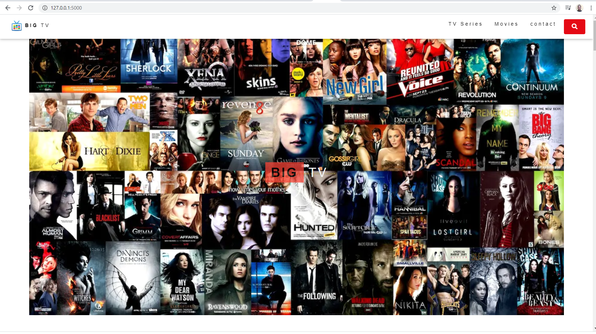

## Valid
series.html
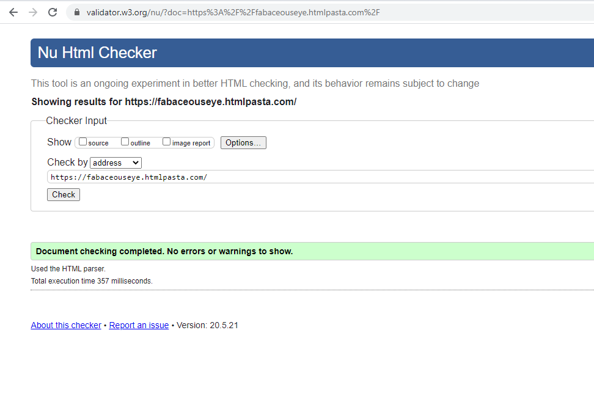
index.html (0 errors this is jinja2 +I used inline style to fix height error)
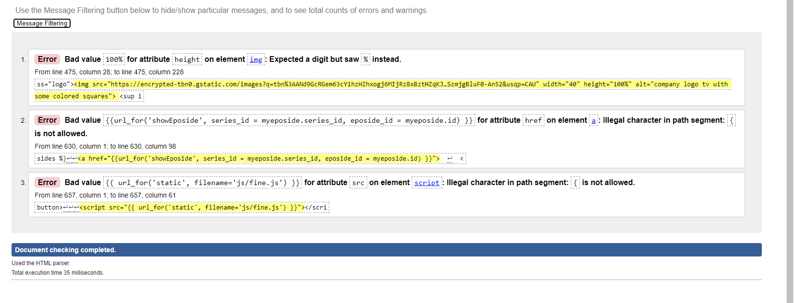

## new video template full resposnive:
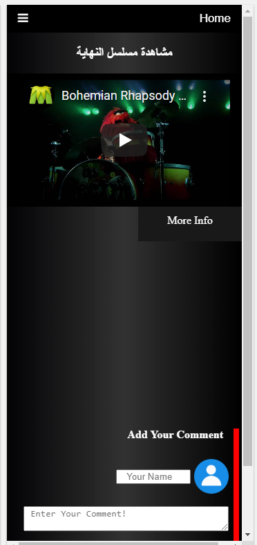
## error handle
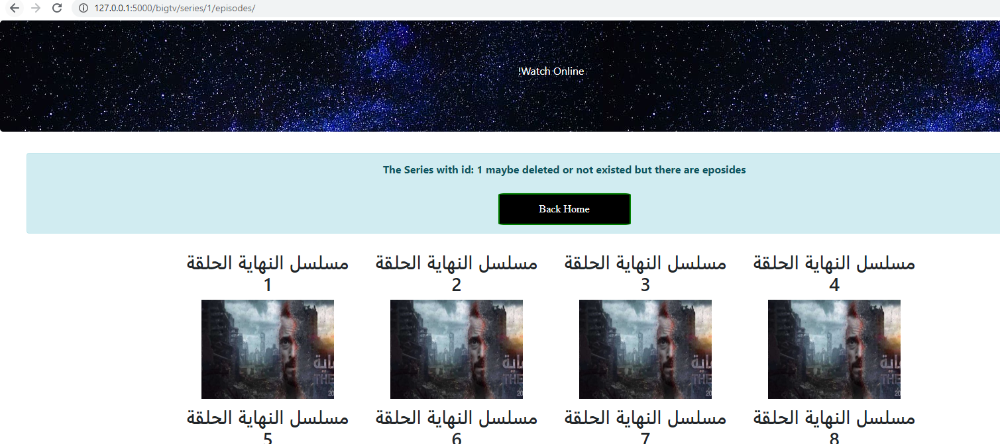
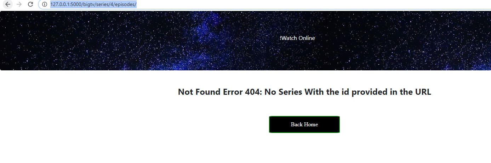
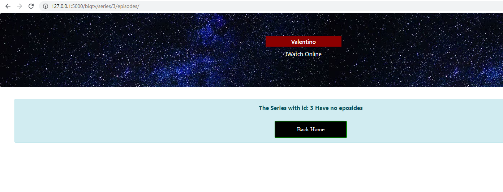

## what needed:
1.  CRUD edite movie
2.  try the api on AWS
3.  add form to pereare for session handling and the admin console which will only the one have ADD, delete, update functions
4.  add full secured form or handle with google Oauth
5.  get domain and lunch this amazing restful API
6.  add new button to series.html to make it down scrol (There is no scroll to last part button in any website 
I'm going to add one ony my restful API.)

## add new series (render text image with ajax from flask webserver)

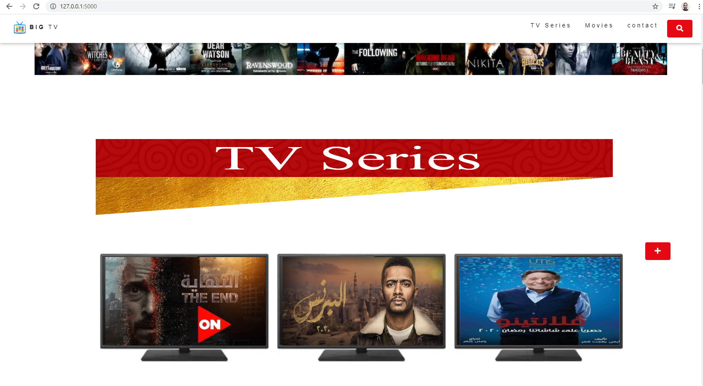

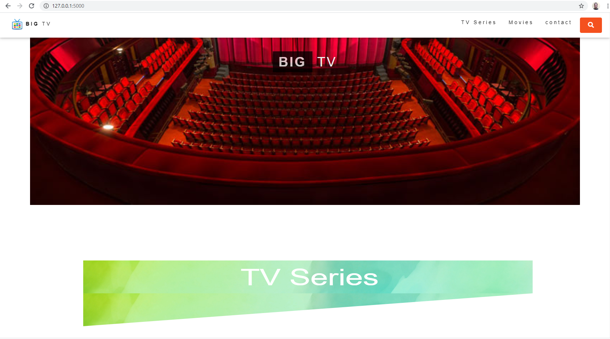
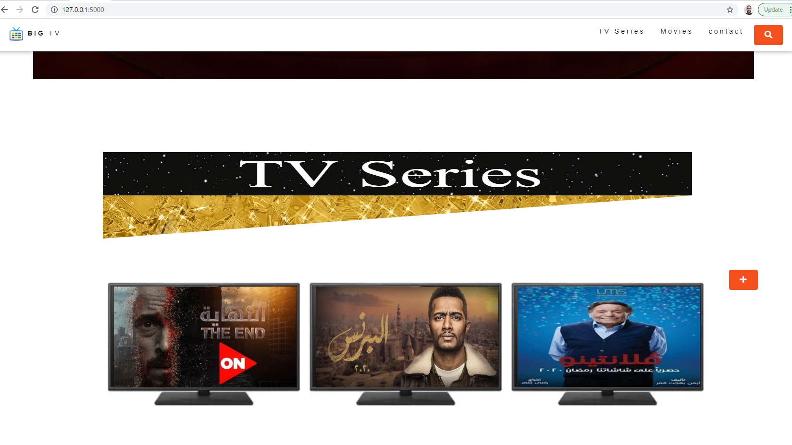

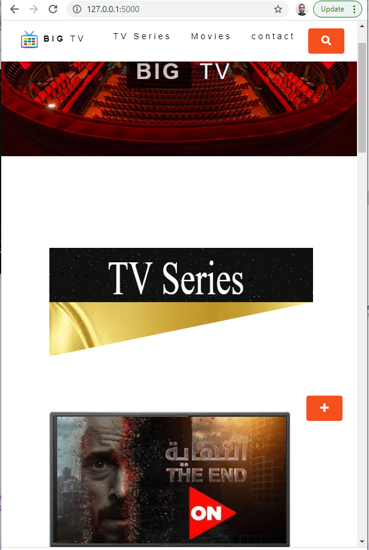
## Add Series (AJAX):

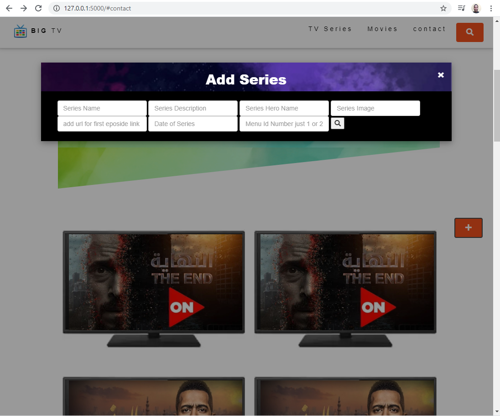

*  Add new Series without Codes only 1 click with AJAX, JS and Jquery, with form handling
*  and all needed js or jquery codes needed to interact with the user and give him better experince
*  with easy and simple way to handle this App
*  Added new Feature to search model if user clicked out side the model it will close the model
*  I closed this feature for adding series model to give a better user experience 

### If you wana download the full project  without images download bigtv_full.zip
first things first Download vagrantfile and install gitbash on windows or terminal on mac and linux
and run vagrant up and then vagrant ssh more details read about vagrant

## I Added AJAX_FLASK_Jquery search funtion to my app at 127.0.0.1/mform

#### Rest Full API it has json end point, and it use Jquery and ajax with flask, it has relational database, I use SQLalchemy and CRUD
#### try /JSON extension to see JSON end points

You Don't have to reload the page to get your search result + you can search for new value and get new result
that's why they call the AJAX the Developer's Dream!

AJAX Search Function (with jquery):

If some one think there is a reapted code in search function so you don't understand the tags 
+ this search function faster than google search :D + it can search for multibplay results on
a diffrent tables not realted and with fast preformerance and with ajax this Search function Really Important

## AJAX Power:
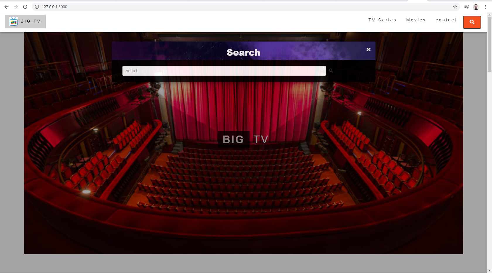
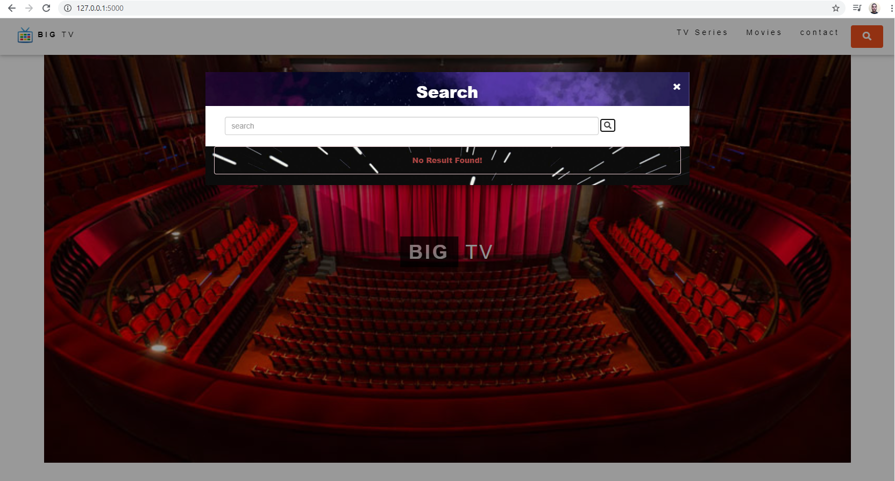
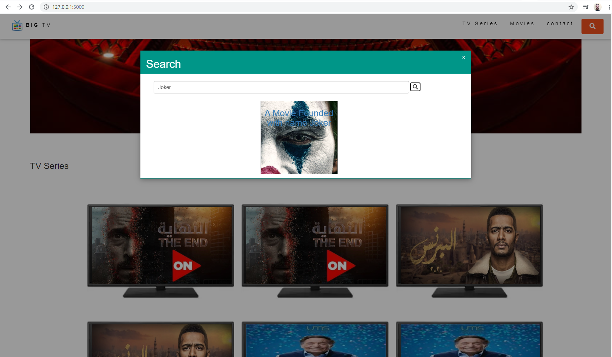

## Python King 
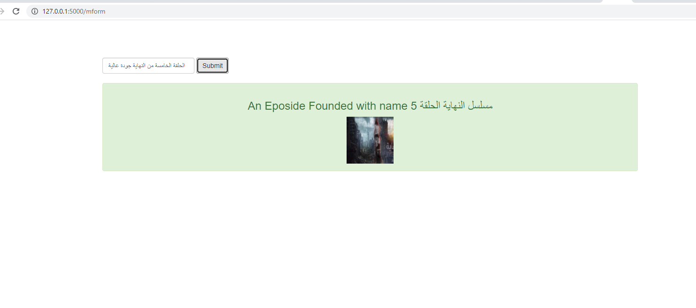

# app 

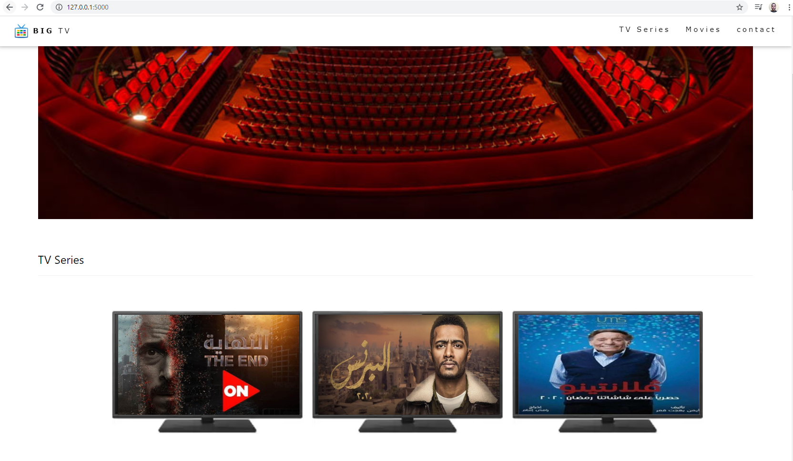

## new page for videos like laroza but better  (valid)
https://www.laroza.tv/video/watch.php?vid=1589cb0a1 

https://fabaceouseye.htmlpasta.com/

www.udacity.com

Thanks for https://znovation.co/ (helped me during my first interview) to focus on AJAX with Jquery and flask, to discover the power of AJAX, with easy steps can be done in minutes)
