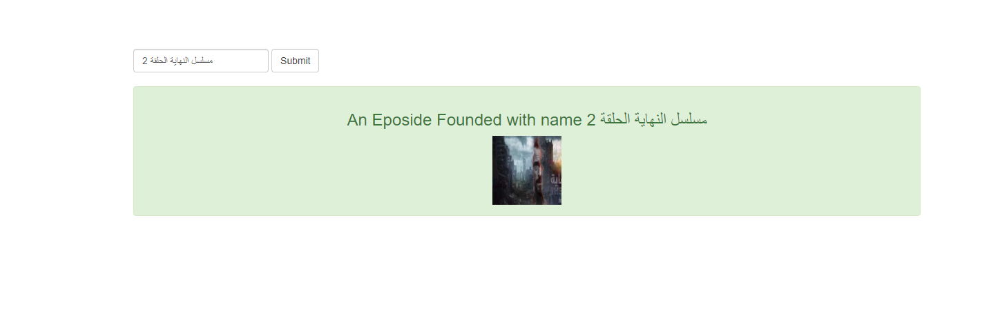
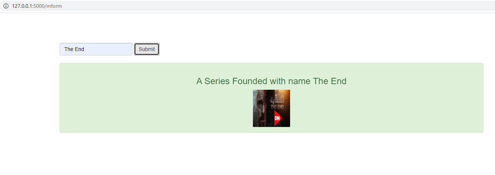

# BigTv RestFul api 
Rest Full API it has json end point, and it use Jquery and ajax with flask, it has relational database, I use SQLalchemy and CRUD
try /JSON extension to see JSON end points

AJAX Search Function (with jquery):

#app 

