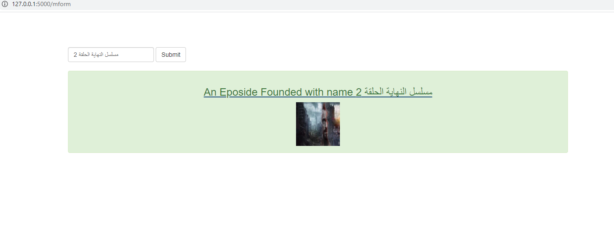
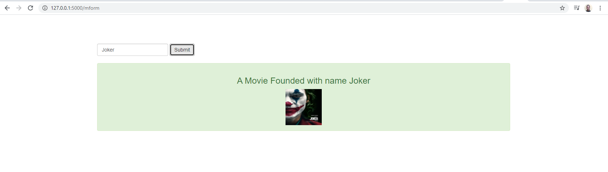

# BigTv RestFul api 

## I Added AJAX_FLASK_Jquery search funtion to my app at 127.0.0.1/mform

#### Rest Full API it has json end point, and it use Jquery and ajax with flask, it has relational database, I use SQLalchemy and CRUD
#### try /JSON extension to see JSON end points

You Don't have to reload the page to get your search result + you can search for new value and get new result
that's why they call the AJAX the Developer's Dream!

AJAX Search Function (with jquery):

# app 

www.udacity.com
